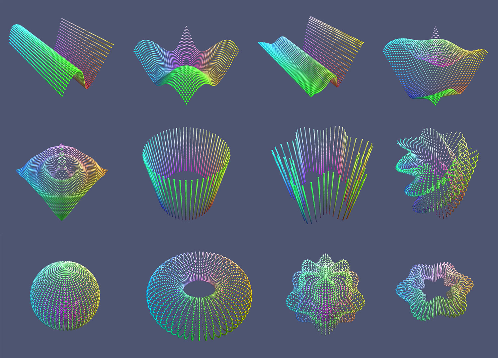

# Mathematical Graphs

A short project for exploring the functions and possibilities to bring mathematics into graphical results.

### Functions
- Sin
- Sine2D
- MultiSine
- MultiSine2D
- Ripple
- Cylinder
- WobblyCylinder
- TwistingCylinder
- Ellipse
- Sphere
- PulsingSphere
- Torus
- InterestingTorus

### Other
With special thanks to [Jasper Flick](https://catlikecoding.com/unity/tutorials/basics/mathematical-surfaces/)